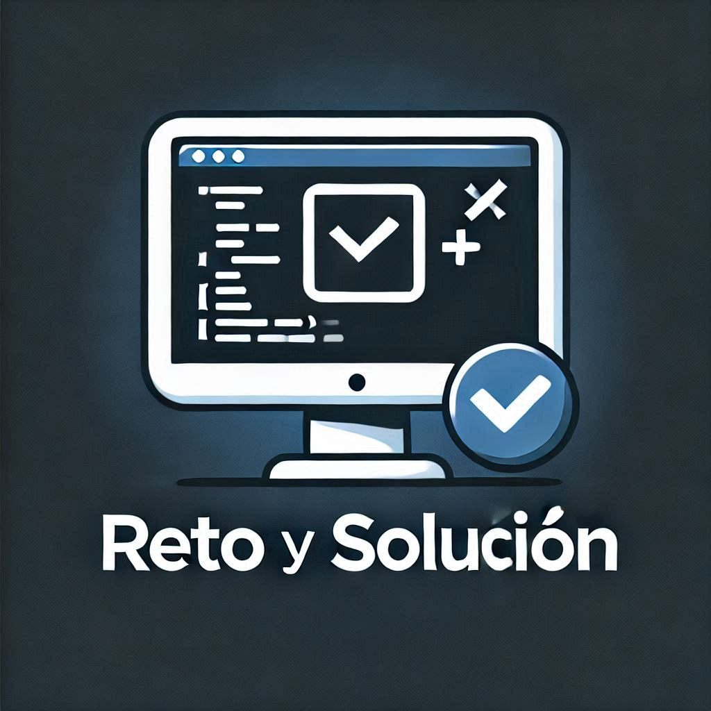

<p align="center">
  
</p>

# 🚀 Retos de programación - Aprende Programando 🔥

¡Bienvenido a **Reto y solución**! Este repositorio está diseñado para ayudarte a mejorar tus habilidades de programación en **PHP** a través de retos prácticos, soluciones explicadas paso a paso y guiones de video para complementar tu aprendizaje.
Seguiré ampliando con retos para **Laravel**, **JS** o **Phyton** por ejemplo.

---

## 📚 Contenido del Repositorio

### **1. Retos de Programación**
Organizados por nivel de dificultad:
- 🟢 **Básico**: Introducción al lenguaje, bucles, arrays, funciones.
- 🟡 **Intermedio**: Manejo de archivos, validaciones avanzadas, conexión a bases de datos.
- 🔴 **Avanzado**: Creación de APIs, patrones de diseño, autenticación.

> Cada reto incluye:
> - Un enunciado claro del problema.
> - Soluciones comentadas en PHP.

---

### **2. Proyectos Relacionados**
Estos retos están diseñados para aplicarse en proyectos prácticos, como:
1. **Generador de Mapas Visuales**: Aprende a trabajar con cuadrículas, arrays multidimensionales y lógica condicional.
2. **Simulador de Ecosistema**: Un proyecto avanzado que simula el comportamiento de plantas y animales.

---

## 🗂️ Estructura del Repositorio
- **/lenguage**
- **/retos/**: Contiene todos los retos organizados por nivel de dificultad.
- **/proyectos/**: Proyectos prácticos relacionados con los retos.

---

## ✨ Cómo Usar Este Repositorio

1. **Explora los Retos:**
   - Navega a la carpeta del nivel que prefieras (`básico`, `intermedio`, `avanzado`).
   - Lee el enunciado del reto en el archivo `README.md` dentro de cada carpeta.
   - Resuelve el problema por tu cuenta antes de revisar la solución.

---

## 🔧 Requisitos

**Antes de comenzar, asegúrate de tener instalado:**
    - **PHP 8.0 o superior**
    - Un editor de texto como [Visual Studio Code](https://code.visualstudio.com/)
    - Opcional: [Composer](https://getcomposer.org/) para manejar dependencias en proyectos avanzados.

---

## 🌟 **Contribuye al Proyecto**

  **¿Tienes una idea para un nuevo reto o una solución alternativa? ¡Eres bienvenido a contribuir!**

    - Haz un fork del repositorio.
    - Crea una rama para tu contribución: git checkout -b nueva-funcionalidad.
    - Envía un pull request con tus cambios.
    - Para más detalles, consulta el archivo CONTRIBUTING.md.

## 📝 Licencia

**Este proyecto está bajo la licencia MIT. Si usas este repositorio, menciona la fuente y compártelo con otros desarrolladores.**

## 🌐 Enlaces Útiles

- [Documentación Oficial de PHP](https://www.php.net/manual/es/index.php)
- [Guía de Composer](https://www.php.net/manual/es/install.composer.intro.php)
- [Canal de YouTube: Reto y Solución](https://www.youtube.com/@RetoySoluci%C3%B3n)

¿Tienes dudas o sugerencias?
- 📧 Envíanos un correo a: [retoyysolucion@gmail.com](mailto:retoyysolucion@gmail.com)


---
## 📖 Ejemplo de Reto Básico - Manejo de Strings

### **Reto Básico 1: Contar Palabras en una Cadena de Strings**
Descripción: 
Crea un script en PHP que cuente cuántas veces aparece una palabra específica en una cadena de texto.

```php
<?php
// Texto de ejemplo
$texto = "PHP es genial. Aprender PHP es divertido y práctico.";
$palabra = "PHP";

// Convertimos el texto en un array de palabras
$palabras = explode(" ", $texto);

// Contamos las coincidencias
$contador = 0;
foreach ($palabras as $p) {
    if (strtolower($p) === strtolower($palabra)) {
        $contador++;
    }
}

echo "La palabra '$palabra' aparece $contador veces.";
?>


